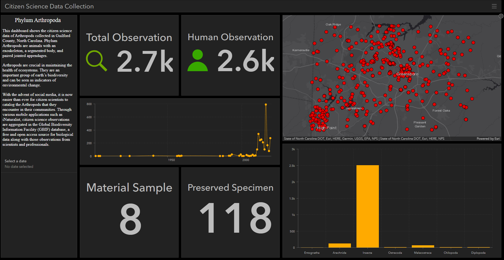
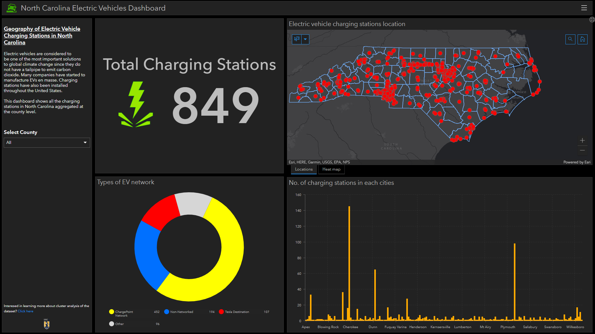
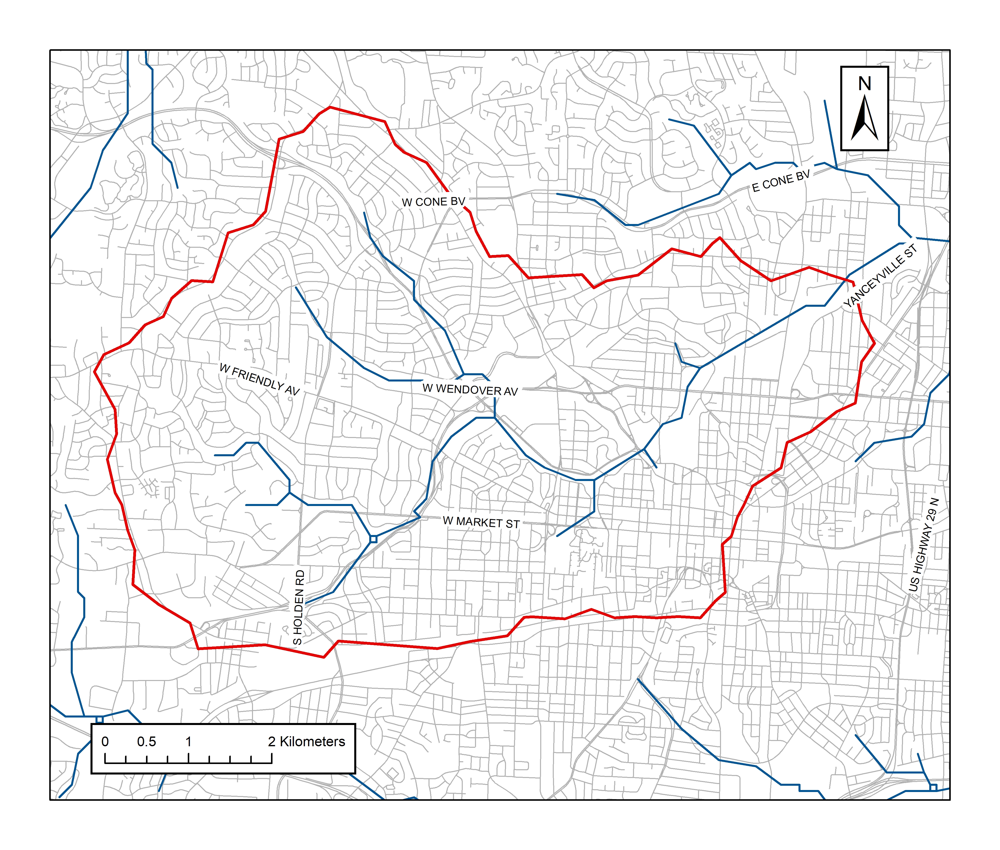
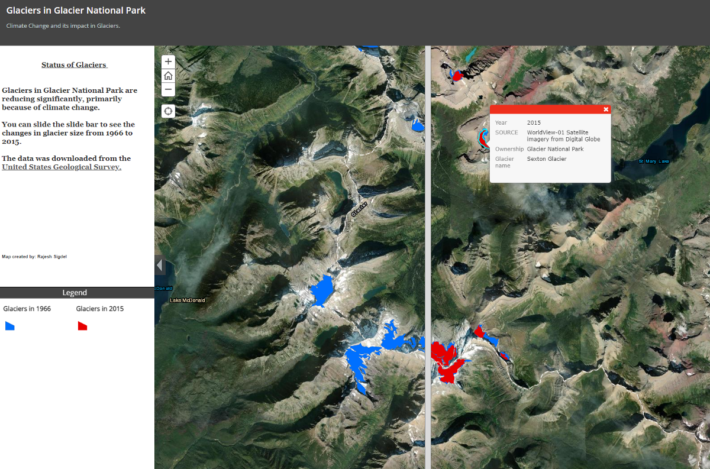
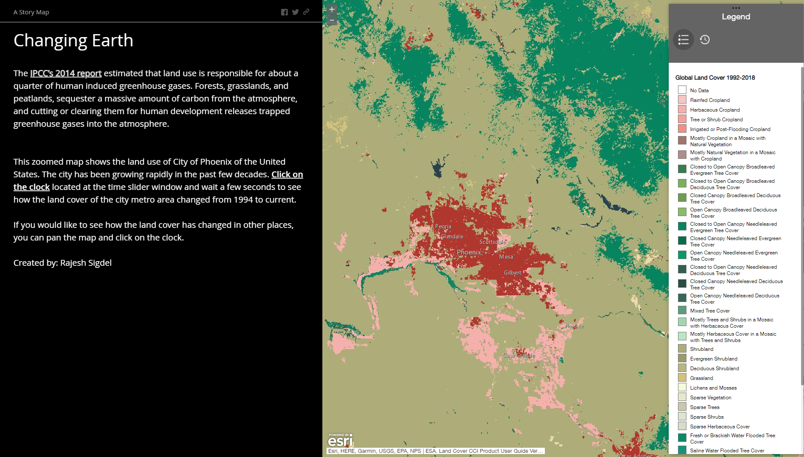
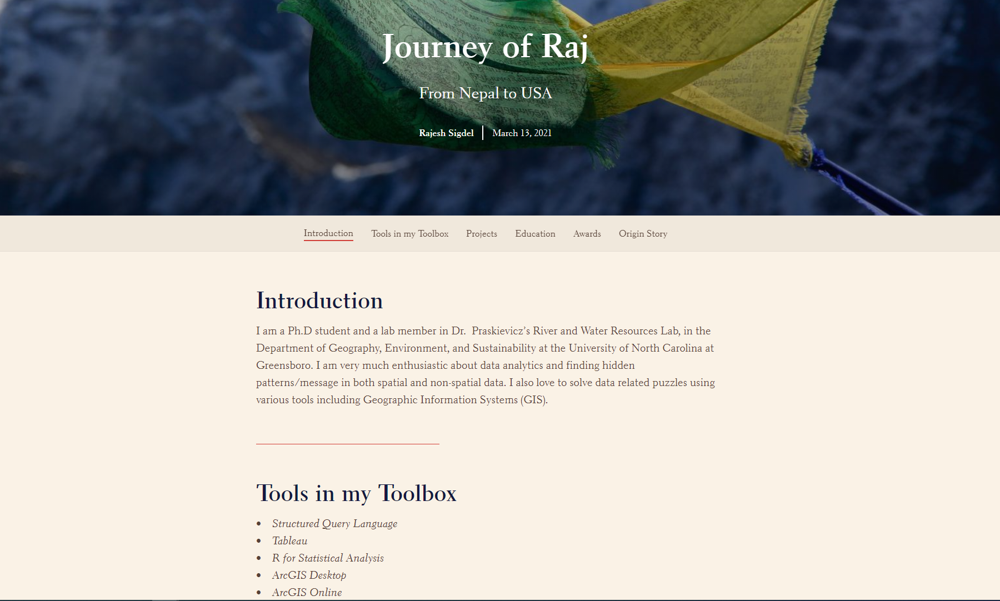
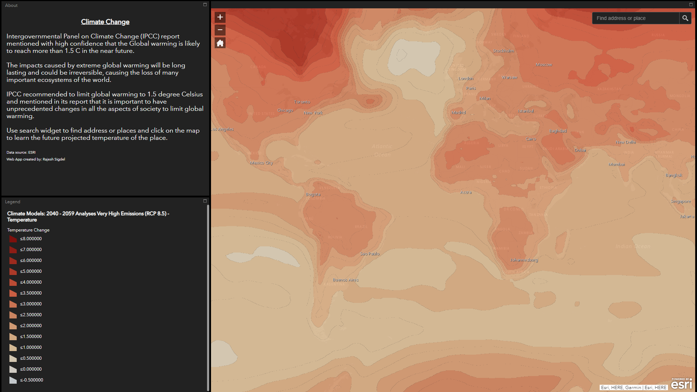

I love wrangling and visualizing spatial data. I primarily use ESRI when working with spatial file. Following are some of the examples of the projects that I worked in various time. The projects consist of:

* ArcGIS/ArcPro maps 
* ArcGIS Online dashboards
* ArcGIS Online web map applications
* ArcGIS Online Story Maps

\
\

# ArcGIS Dashboards

Here are the ArcGIS dashboards that I created.

## Citizen Science Data 

{target="_blank"}

Electric vehicles (EV) are considered to be one of the most important solutions to global climate change since they do not have a tailpipe to emit carbon dioxide. Many companies have started to manufacture EVs en masse. Charging stations have also been installed throughout the United States.

This **dashboard** shows all the charging stations in North Carolina aggregated at the county level.

<a href = "https://uncg.maps.arcgis.com/apps/dashboards/062422f65cde485494480dd77c17a810" target= "_blank">  Click here</a> to view the dashboard.

\

## Electric Vehicle

{target="_blank"}

Electric vehicles (EV) are considered to be one of the most important solutions to global climate change since they do not have a tailpipe to emit carbon dioxide. Many companies have started to manufacture EVs en masse. Charging stations have also been installed throughout the United States.

This **dashboard** shows all the charging stations in North Carolina aggregated at the county level.

<a href = "https://uncg.maps.arcgis.com/apps/dashboards/d8c35828c7a4489ea2e9a6b7d69e817d" target= "_blank">  Click here</a> to view the dashboard.

\

---

# Maps

Below is the list of the maps that I created using ESRI's ArcMap or ArcGIS Pro. 

## Delineation of Streams 

Watershed is an area of the land that drains into a common outlet (pour point). Triangulated Irregular Networks are useful in visualizing terrain of the earth. I created a Triangular Irregular Network of my study site of the North Buffalo Creek using ArcMap 10.5.

<a href = "https://drive.google.com/file/d/1K6hD6qZEb8wR5l2CGy99__Z6tm0xbs6G/view?usp=sharing" target= "_blank">  Click here</a> to view the map. 

<a href = "https://drive.google.com/file/d/1UZp5fZM2KkCCul32ALvldBSUYAGIL12s/view?usp=sharing" target= "_blank">  Click here</a> to view the model builder workflow of the analysis. 

\
\
\
\
\

## TIN Map

Watershed is an area of the land that drains into a common outlet (pour point). Triangulated Irregular Networks are useful in visualizing terrain of the earth. I created a Triangular Irregular Network of my study site of the North Buffalo Creek using ArcMap 10.5.

I used two feet countour interval of the Guilford country that was downloaded from the North Carolina State GIS website. Some of the tools used to create the map were: Fill tool, flow direction, flow accumulation, pourpoint, and raster to vector conversion.

<a href = "https://uncg.maps.arcgis.com/apps/MapJournal/index.html?appid=f80274d5c0234a67ae3341c890981b5c" target= "_blank">  Click here</a> to view the application.

\
\
\

## Watershed Map

ArcGIS software was used delineate the watershed of my study site. The intersection of Yanceyville street and North Buffalo Creek was chosen as a pour point. 

Digital Elevation Model (DEM) was downloaded from the North Carolina GIS archive. First "fill" tool was used to create a depressionless DEM. Then, flow direction grid was created which was followed by the creation of flow accumulation raster. 

The pour point was used to create watershed raster which was then converted to polygon. 

<a href = "https://drive.google.com/file/d/1W2KHsKIwyK0YjfYYIeg89TQV2qsHtNww/view?usp=sharing" target= "_blank">  Click here</a> to view the map. 

\
\

---

# Apps

Below are some of the applications I created using ArcGIS online.

## Glaciers in GLP

Glaciers are huge mass of ice that move slowly due to the influence of its own weight and gravity. Glaciers are the largest reservoir of fresh water in the world. Many glaciers around the globe are retreating (reduction of size by melting) at an unprecedented rate. 

Using publicly-available spatial data from the USGS, I created an application in **ArcGIS online** where users can manipulate a slide bar to see the changes in individual glaciers at Glacier National Park between 1966 and 2015. Click here to interact with the application.

<a href = "https://uncg.maps.arcgis.com/apps/StorytellingSwipe/index.html?appid=2e8b4a5555f34bc9bb8ec6279de814c3" target= "_blank">  Click here</a> to view the application.

\

## Land Cover change

Using publicly available dataset from ESRI, I created a **web map application (ArcGIS Web AppBuilder) in ArcGIS Online** that depicts the temporal and spatial land cover change of the Earth from 1994 to 2018.It 

It is hoped that visualizations like this helps public understand how the land cover is changing and encourages them to take actions to decrease green house gas emissions that are emitted from changing land cover. 

<a href = "https://uncg.maps.arcgis.com/apps/MapJournal/index.html?appid=f80274d5c0234a67ae3341c890981b5c" target= "_blank">  Click here</a> to view the application.

\

## Story Map (Website)

I created a **story map** to show the journey of mine from Nepal to United States. 

The story map was created using **ArcGIS online Story Map application.**

Click on the link to view the Story Map: https://arcg.is/19qnqS0

\
\
\
\

## Global Warming

Intergovernmental Panel on Climate Change (IPCC) report mentioned with high confidence that the Global warming is likely to reach more than 1.5 C in the near future. 

Using an available raster dataset from ESRI, I created an application that shows projected increases in the temperature of the Earth at different locations.

<a href = "https://uncg.maps.arcgis.com/apps/webappviewer/index.html?id=681d6a0833104fbba0686503fb82da5c" target= "_blank">  Click here</a> to view the application.

\
\

---