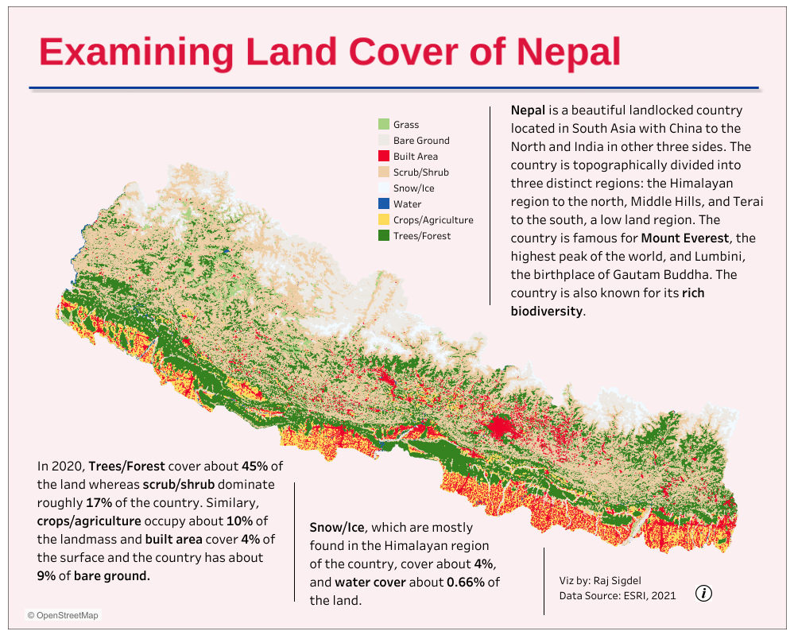
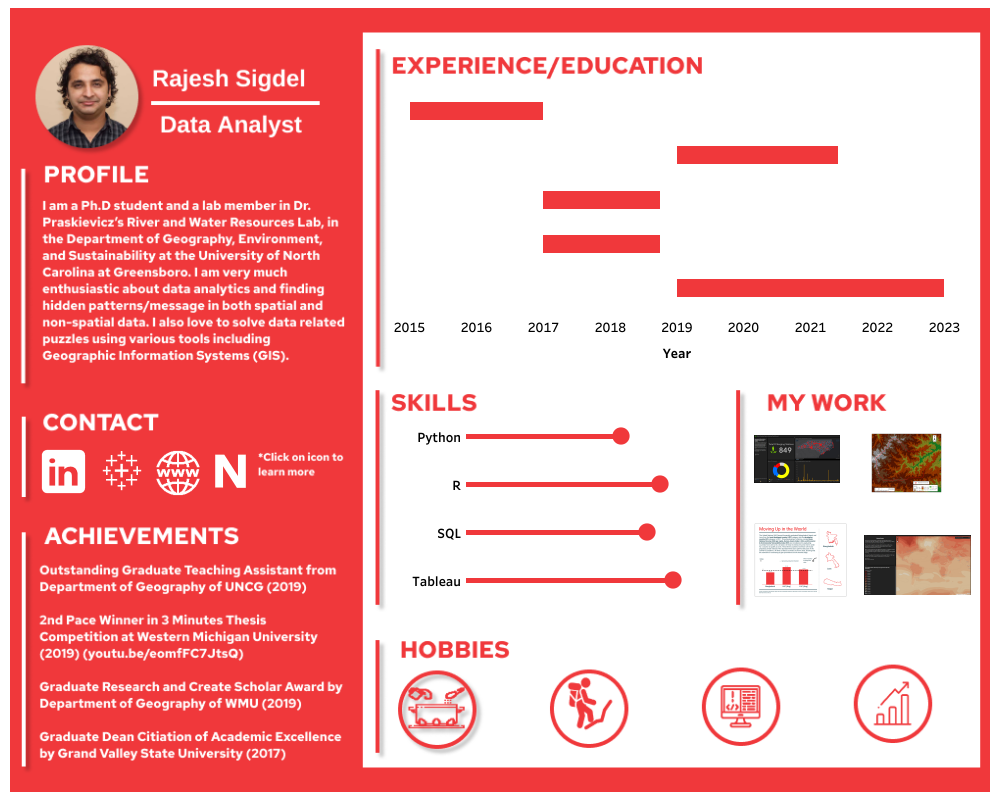
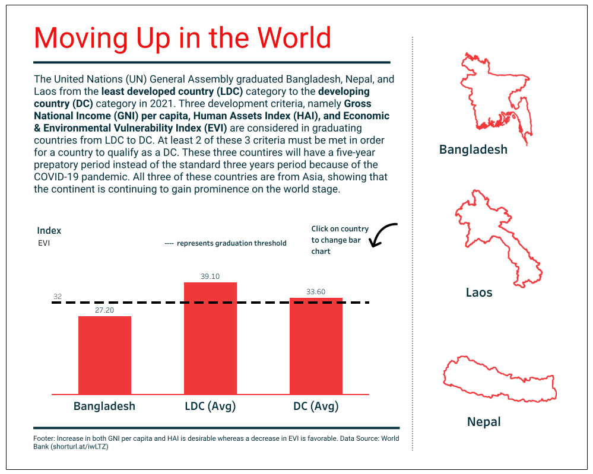
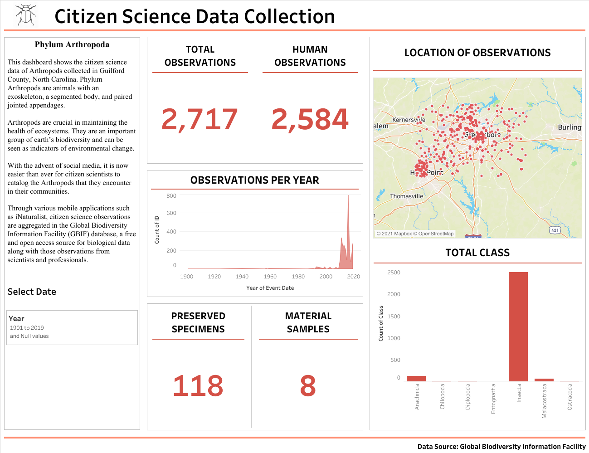
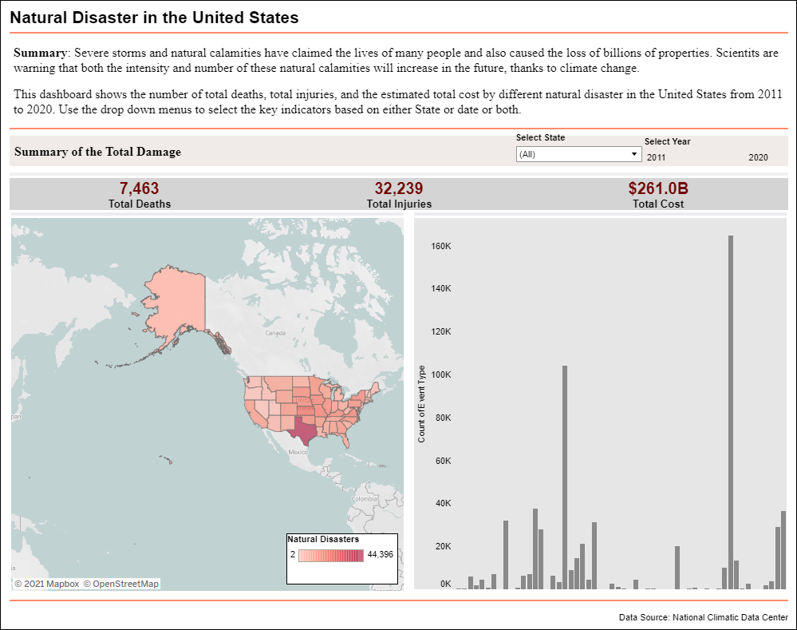
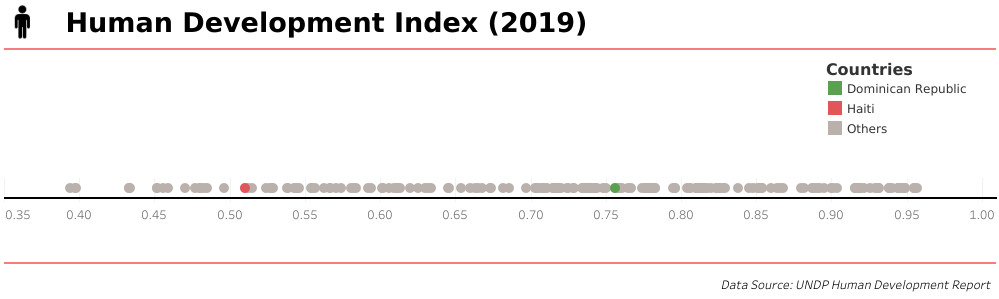

**Under Construction**

Tableau is my favorite tool when it comes to visualizing non-spatial data. I love its flexibility in giving actionable insights of the data. It also helps tp analyze the data rapidly which helps make business faster. 

\

# Examining Land Cover of Nepal

{target="_blank"}

This project examines the land cover of Nepal of 2020. Nepal is a small beautiful landlocked country located in South Asia with China to the North and India in other three sides. The country is topographically divided into three distinct regions: the Himalayan region, Middle Hills, and Terai. 

The country is famous for Mount Everest, the highest peak of the world, and Lumbini, the birthplace of Gautam Buddha. The country is also known for its rich biodiversity.

Click on the image to view dashboard in Tableau Public. 
\
\
\
\

---

# Resume in Tableau

{target="_blank"}

In Tableau, you can build your own interactive resume and highlight important milestone and achievements in it. You can also include your education, skills, and experiences to show to your potential employer. 

I also created an interactive resume using Tableau. Please click on the image to view the resume in Tableau Public.

\
\
\
\
\
\
\
\
\

---

# Moving Up in the World

{target="_blank"}

Natural Disasters such as storms, hurricanes, and flash floods claims thousands of lives of lives each year in the United States. I downloaded the Storm Events Data from the NOAA’s National National Weather Service (NWS) website and created a dashboard using Tableau software.

The date ranged from 20211 to 2020 and the data were downloaded in .csv format (10 .csv file total). The data was cleaned up/joined in R and Excel.

\
\
\
\
\
\

---

# Citizen Science

{target="_blank"}

Natural Disasters such as storms, hurricanes, and flash floods claims thousands of lives of lives each year in the United States. I downloaded the Storm Events Data from the NOAA’s National National Weather Service (NWS) website and created a dashboard using Tableau software.

The date ranged from 20211 to 2020 and the data were downloaded in .csv format (10 .csv file total). The data was cleaned up/joined in R and Excel.

\
\
\
\
\
\

---

# Natural Disaster

{target="_blank"}

Natural Disasters such as storms, hurricanes, and flash floods claims thousands of lives of lives each year in the United States. I downloaded the Storm Events Data from the NOAA’s National National Weather Service (NWS) website and created a dashboard using Tableau software.

The date ranged from 20211 to 2020 and the data were downloaded in .csv format (10 .csv file total). The data was cleaned up/joined in R and Excel.

\
\
\

\
\

---

# Human Development Index

{target="_blank"}

Natural Disasters such as storms, hurricanes, and flash floods claims thousands of lives of lives each year in the United States. I downloaded the Storm Events Data from the NOAA’s National National Weather Service (NWS) website and created a dashboard using Tableau software.

The date ranged from 20211 to 2020 and the data were downloaded in .csv format (10 .csv file total). The data was cleaned up/joined in R and Excel.

\
\
\
\
\

